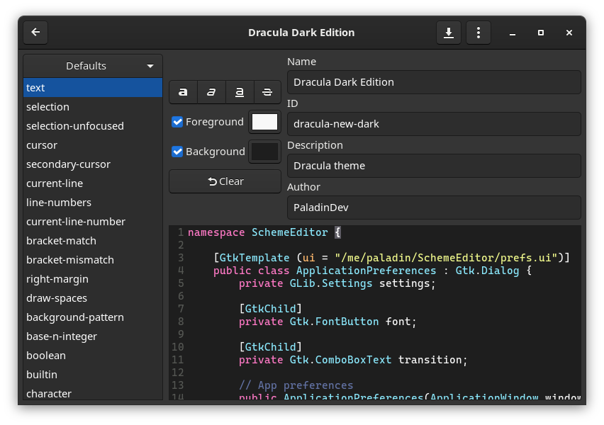

# Scheme Editor (deprecated, use [Schemes](https://gitlab.gnome.org/chergert/schemes))

Color scheme editor for [GtkSourceView](https://wiki.gnome.org/Projects/GtkSourceView)

## Installation
    $ meson _build
    $ cd _build
    $ ninja install
